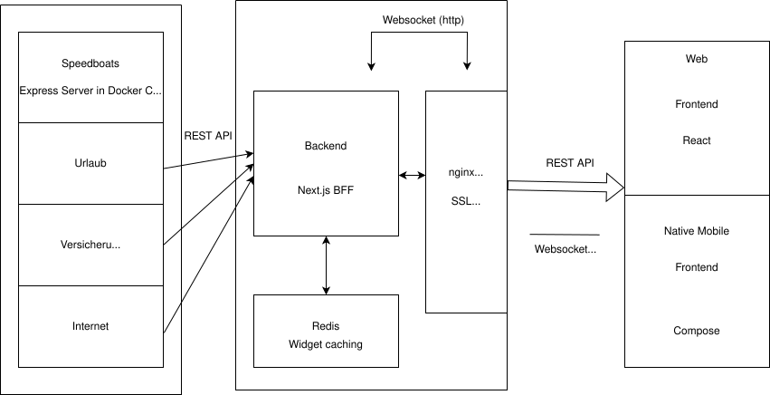

# CONCEPT.md

## Einleitung
Diese Dokumentation beschreibt die Architekturentscheidungen für das Projekt mit Begründungen, bewussten Trade-offs und Verbesserungsmöglichkeiten für ein Production-Ready-System.

---

## Web

### Frontend

#### React + TailwindCSS
**Implementiert:**
- React mit funktionalen Komponenten und Hooks
- TailwindCSS
- Hybrid SSR/CSR Ansatz mit Next.js

**Warum:**
- Einfaches State Management mit React
- SSR liefert schnelleres rendern als CSR bei initialen Loads
- CSR für interaktive Komponenten nach Initial Load (schnellere Time to Interactive)
- TailwindCSS für Utility-First und Optimierte Dateigröße
- SSR für Suchmaschinenoptimierung

**Trade-offs:**
- React Runtime-Overhead, für simple Anwendung überdimensioniert
- SSR erhöht Serverlast und potenzielle Skalierungsprobleme bei vielen Anfragen

**Verbesserung für echtes Produkt:**
- Möglich wäre ein leichteres Frontend Framework wie Preact
---

### Backend

#### Next.js (Backend for Frontend)
**Implementiert:**
- Next.js API Routes als BFF-Layer
- Orchestrierung zwischen Frontend und Speedboat-Services
- Server Side Rendering und Client Side Rendering Komibiniert

**Warum:**
- Zentrale API-Orchestrierung druch einem Endpoint für Frontend statt mehreren Microservice-Calls
- Backenddaten werden für das Frontend schön aufbereitet
- Steigert Wartbarkeit durch weniger Komplexität bei der API Kommunikation
- Hilft bei graceful degradation

**Trade-offs:**
- Kann schnell zu einem Monolith werden
- Mehr Wartung erforderlich durch eine Extra Schickt in der Architektur

**Verbesserung für echtes Produkt:**
- Mehrere Next.js-Instanzen hinter Load Balancer
- Separater BFF für Mobile und Web bei stark divergierenden Anforderungen

---

#### Redis
**Implementiert:**
- In-Memory Cache für häufig abgefragte Daten

**Warum:**
- Verbessert Performance von 50ms zu 14ms in einem von mir ausgeführten Test
- Gut für Skalierung durch natives Clustering, Disk I/O Dumping und weiteres

**Trade-offs:**
- Nur in Memory führt zu Datenverlust bei Server-Crash
- Single Point of Failure ohne Replication

**Verbesserung für echtes Produkt:**
- Redis Cluster
- Redis Sentinel
- Redis als Session Store für echte User

---

#### Docker
**Implementiert:**
- Containerisierung von Next.js, Redis, nginx
- docker-compose für lokale Entwicklung
- Reproduzierbare Build-Umgebung

**Warum:**
- Von Dev auf Production ist schneller
- Unabhängigkeit vom Host-System
-  `docker-compose up` statt manuelle Installation

**Trade-offs:**
- Overhead: ~100MB pro Container (Base Images)
- Komplexität für einfache Anwendungen erhöht

**Verbesserung für echtes Produkt:**
- Health Checks für Automatische Container-Restarts bei Fehlern
- Resource Limits

---

#### Socket.io
**Implementiert:**
- Real-time Kommunikation und Updates
- Event-basierte Nachrichtenübermittlung

**Warum:**
- Automatisches Wiederverbinden bei Verbindungsabbruch
- Gezielte Broadcasts möglich
- Kein HTTP Polling nötig
- Einfache Integration

**Trade-offs:**
- Hoher Ressourcenverbrauch bei vielen Connections
- WebSocket-Firewall-Probleme in Enterprise-Netzwerken
- Skalierung wird dadurch erschwert

**Verbesserung für echtes Produkt:**
- MQTT ist Leichtgewichtiger
---

#### REST API
**Implementiert:**
- JSON über HTTP für Frontend-Backend und Backend-Speedboats Kommunikation
- OpenAPI-Dokumentation für API-Contracts

**Warum so:**
- Alternativen wie gRPC-Web benötigt Proxy
- cURL, Postman, Browser DevTools funktionieren und bieten einfacheres debugging
- JSON ist gut zu lesen

**Trade-offs:**
- Langsamer als gRCP
- Höhere Latenz bei kleinen Payloads im Gegensatz zu gRCP

**Verbesserung für echtes Produkt:**
- gRCP für bessere Performance
---

### User und Session Management
**Implementiert:**

-   User werden im Backend verwaltet
-   Aktuell eine Session für Alle mit hardcoded Userdaten

**Production-Ready:**

-   Server-seitige Sessions mit Secure, HttpOnly, SameSite-Cookies.
-   Session-Store in Redis mit TTL, um Logins automatisch ablaufen zu lassen.
-   Passwort-Hashing (z.B. Argon2 / bcrypt), Account-Locking nach Fehlversuchen.
-   Rollen-/Rechte-Modell (z.B. USER, ADMIN, SERVICE) und Permission-Checks auf API-Ebene.
---

### Speedboats

#### Express-Microservices
**Implementiert:**
- Autonome Express-Services für spezifische Domänen
- REST API für Kommunikation mit Next.js BFF
- Unabhängige Deployment-Units

**Warum:**
- Teams arbeiten parallel ohne Merge-Konflikte
-  Speedboats können ihre eigenen Technologien unabhängig von anderen verwenden
-  Ein Speedboat-Crash crasht nicht das ganze System
- High-Traffic Speedboat horizontal skalieren, andere nicht

**Trade-offs:**
- Debugging über Service-Grenzen schwieriger
- Overhead: Mehrere Deployments, Logs, Monitoring-Dashboards

**Verbesserung für echtes Produkt:**
- Separate Teams mit eigener Architektur
- Eigene CI/CD Pipelines
- Apache Kafka für asynchrone Inter-Service-Messages
- Mehr Designmöglichkeiten für die einzelnen Microservices

---

## Mobile

### Frontend

#### Jetpack Compose + Retrofit
**Implementiert:**
- Jetpack Compose für deklaratives UI
- Retrofit für HTTP Client
- Kotlin Coroutines für asynchrone Operationen

**Warum:**
- Direkter Android-Zugriff ohne JavaScript-Bridge
- Compose benötigt deutlich weniger Code als XML Views
- Moderne Architektur Patterns sind einfacher zu implementieren wie zum Beispiel ViewModels,
  StateFlow etc.

**Trade-offs:**
- Nur auf Android ausführbar

**Verbesserung für echtes Produkt:**
- Room Datenbank

## Deployment

### CI/CD
**Implementiert:**
- Lokale Docker-Container
- Nginx als Reverse Proxy
- Hetzner Cloud als Provider
- GitHub Actions für CI/CD
- SSL via Let's Encrypt und Certbot
- SSL erneuerung via Cronjob

**Warum:**
- Automatisierte Deployments
- Https Verbindungen für eine sichere Kommunikation
- Einfaches Setup mit Docker
- Kostengünstiger Provider mit guten Skalierungsmöglichkeiten

**Trade-offs:**
- Manuelles Setup der Server Infrastruktur

**Verbesserung für echtes Produkt:**
- Load Balancer für horizontale Skalierung
- Ansible für automatisiertes Server Setup
- Monitoring mit Prometheus + Grafana
- Automatisiertes SSL Zertifikatsmanagement

Der Proof of Concept priorisiert Architektur und Systemverhalten über Feature-Tiefe.
Einige Entscheidungen wurden bewusst vereinfacht, um Komplexität zu reduzieren und den Fokus zu wahren:

- vereinfachtes User- & Session-Handling
- manuelles Infrastruktur-Setup
- eingeschränkte Plattformabdeckung